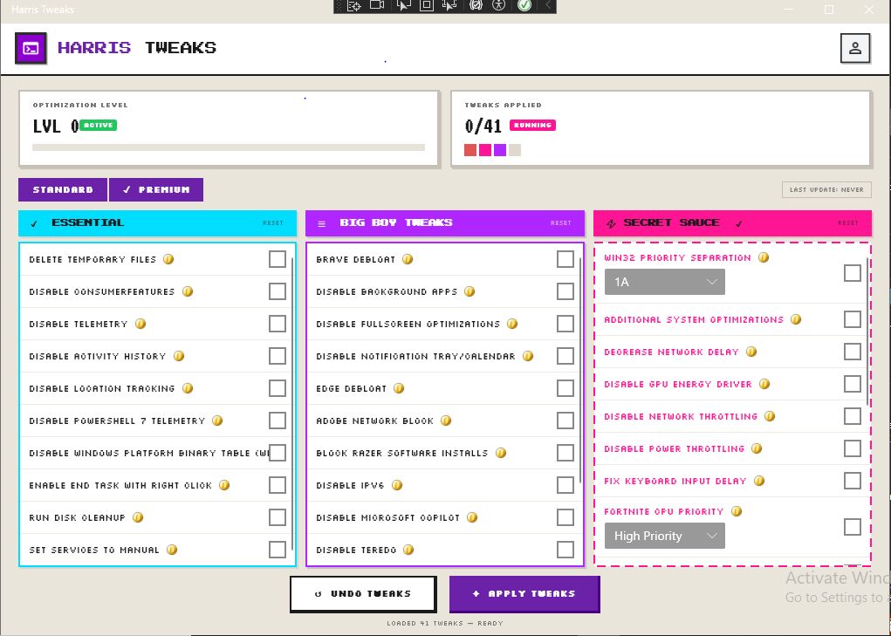

# Harris Tweaks

A retro-styled Windows optimization tool for competitive gamers.

---

## What is this?

Harris Tweaks strips your PC down to what matters — disabling telemetry, killing background processes, tweaking network settings, and squeezing more performance out of your hardware. No cloud, no subscriptions, no fluff.

---

## Features

### Essential Tweaks

- Delete temporary files and run disk cleanup
- Disable telemetry, activity history, and location tracking
- Disable Consumer Features and PowerShell 7 telemetry
- Set services to manual for a leaner boot
- Enable "End Task" via right-click
- Disable Windows Platform Binary Table (WPBT)

### Big Boy Tweaks

- Brave and Edge debloat
- Disable background apps and notification tray/calendar
- Disable fullscreen optimizations
- Block Adobe network traffic, Razer bloatware, and Microsoft Copilot
- Disable IPv6 and Teredo tunneling

### Pro Tweaks

- Win32 Priority Separation tuning
- Additional system optimizations
- Reduced network delay and disabled network throttling
- Disable GPU energy driver and power throttling
- Fix keyboard input delay
- Fortnite GPU high priority mode

---

## Tech Stack

| Component | Technology |
|---|---|
| **Framework** | .NET 10 / WPF |
| **UI Theme** | ModernWPF + custom retro pixel art |
| **Fonts** | Press Start 2P, Silkscreen, VT323 |
| **Architecture** | MVVM with service locator DI |

---

## Disclaimer

This tool modifies Windows registry keys and system services. **Always create a restore point before applying tweaks.** Use at your own risk — the developers are not responsible for any system instability caused by applied tweaks.

---

Built by [Usman Khan](https://github.com/Usman-Khan49)

